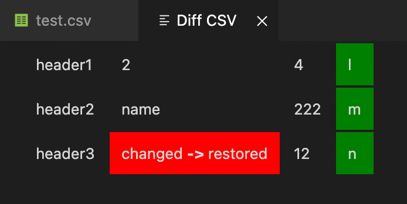

# diffcsv README

Provides Git diff of csv file between current and HEAD~1 in tabular form with colours.

## Features

## Known Issues

Avoid triggering it in non-csv files, behaviour can be undefined.

## Release Notes

Currently supports coloured tabular git diff.

### 1.0.0

Initial release

